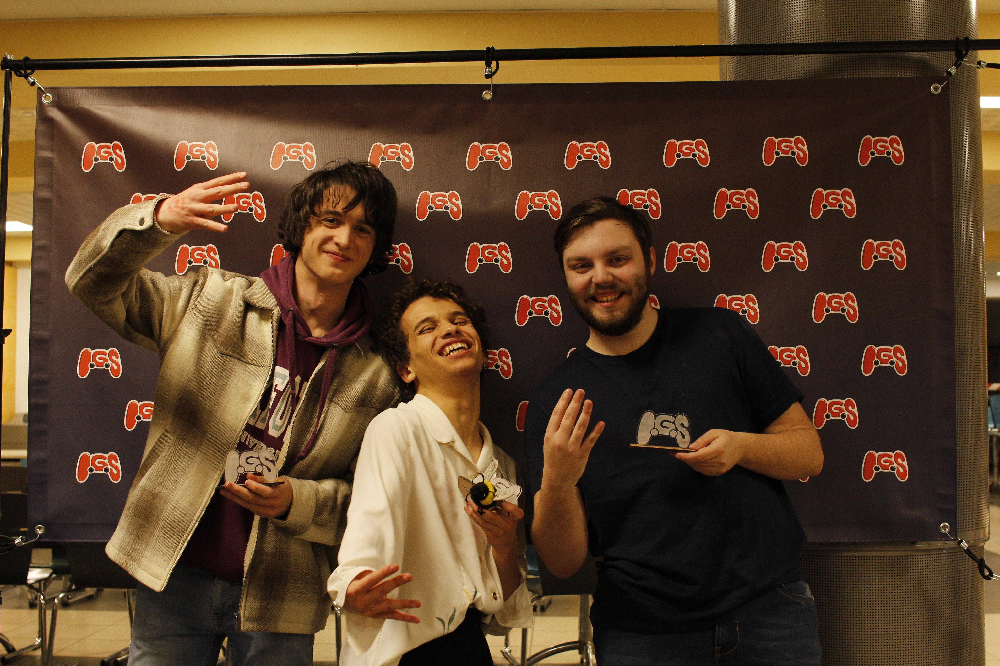
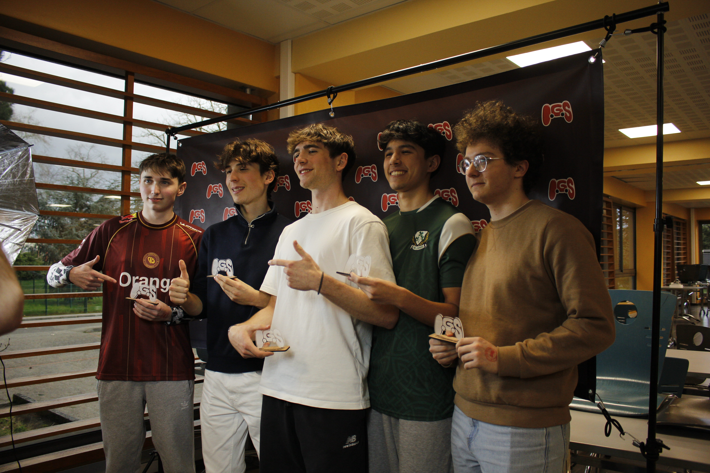
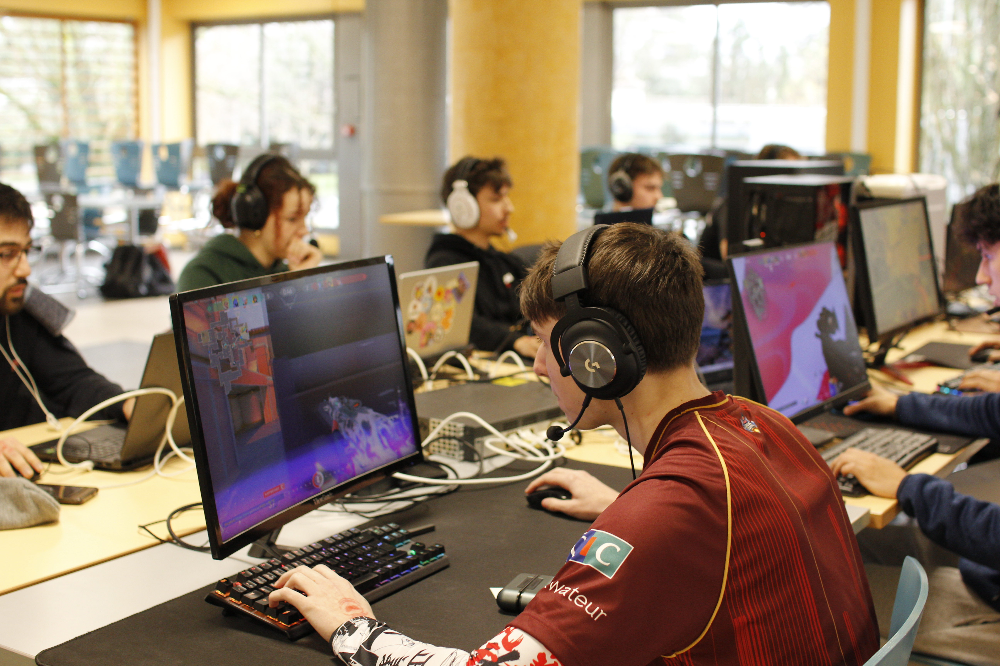
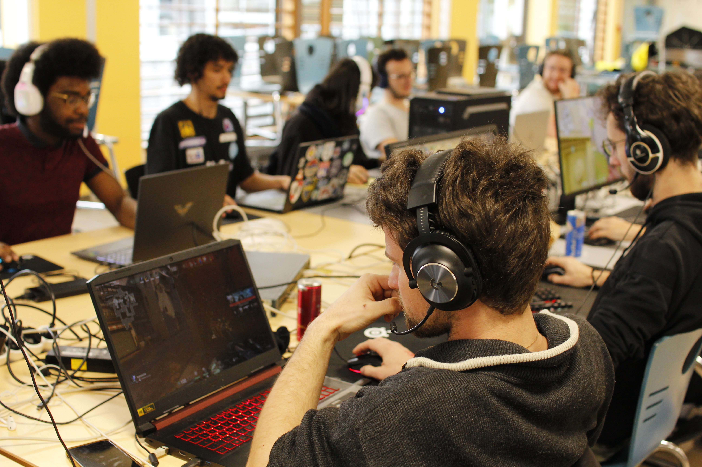
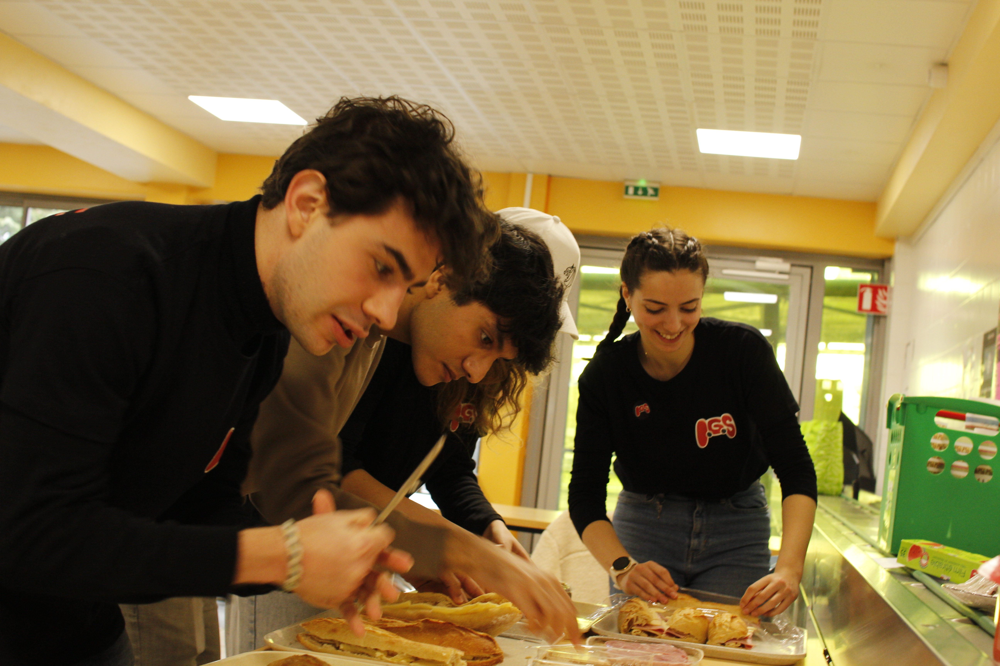
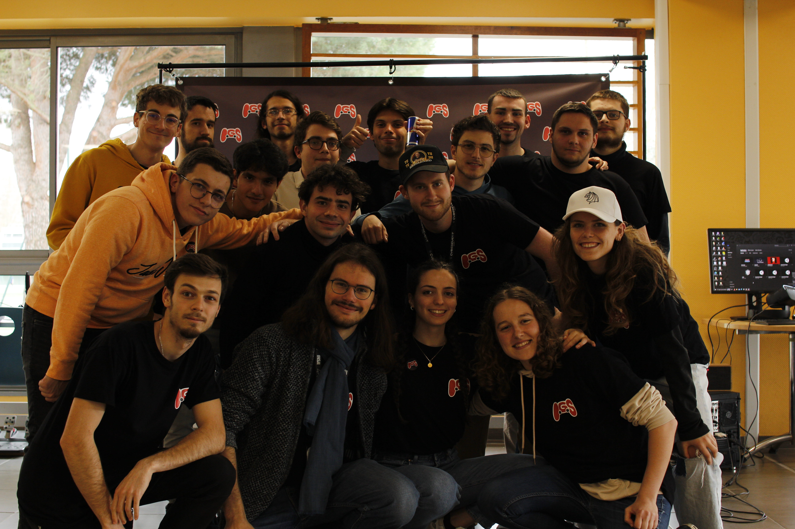

L’IGS (INSA Game Show) est un évènement autour du jeu vidéo organisé par le Club Info. Anciennement organisé par le club INSA Gaming ayant désormais fusionné avec le Club Info, l’évènement a disparu avec le confinement en 2020. L’évènement se déroule historiquement dans le RU de l’INSA, une salle bien connue des étudiants qui jouent à domicile.

Depuis l’année dernière, cet évènement a revu le jour. Au programme de l’IGS : des tournois sur différents jeux vidéo, des stands de démonstration de jeux indépendants, des jeux en libre accès et aussi une buvette. Compétiteur dans l’âme, joueur du dimanche ou bien juste curieux, cet évènement est fait pour vous. L’IGS est de loin l’évènement le plus convivial et avec la meilleure ambiance de tous les évènements de l’année.

Toutes les informations par rapport à l'IGS peuvent être retrouvées sur [https://igs.insat.fr](https://igs.insat.fr).

## IGS 2024-2025

🔥 Retour sur l’IGS 2025 : un week-end épique ! 🔥

Le week-end du 8 et 9 mars, l’INSA Game Show a transformé le RU en véritable arène de gaming, pleine de joie et de bonne humeur. C'était une édition mémorable ! 🎮💥

Samedi, le tournoi Multigaming a offert un spectacle intense avec des défis variés allant de la baston sur Brawlhalla aux courses endiablées sur SuperTuxKart. Contre toute attente, Les 4 Fantastiques ont décroché la victoire grâce à une régularité exemplaire, sans jamais remporter une seule épreuve… un exploit unique ! 🏆

Dimanche, place au tournoi Valorant, où l’équipe EGirls Hunters a imposé sa loi en dominant la compétition. Leur précision chirurgicale et leur coordination sans faille leur ont permis de repartir avec la victoire. 🎯💣
Ces deux équipes ont chacune remporté 250€ de cashprize, après avoir affronté de vaillants adversaires parmi 8 équipes sur le Multigaming et 7 sur Valorant.

Voici nos heureux gagnants : 

Mais l’IGS, c’était aussi un week-end d’animation avec des stands VR, simulation automobile et Dance Dance Revolution, qui ont conquis joueurs et spectateurs ! 

Pendant ce temps, la buvette du Club Info n’a pas désempli, portée par une team de bénévoles au top. 👏

Tout cela n'aurait pas été possible sans l'implication et l'engagement des membres du bureau de l'IGS 2025.

Un immense merci à Viveris, la Fondation INSA, Sopra Steria, le CROUS et Asobo pour leur soutien, ainsi qu’au Pôle Huma et au Club Neo Tokyo pour leur précieuse collaboration. 🙌

L’IGS 2025, c’était du fun, du skill et une ambiance électrique. On espère vous retrouver encore plus nombreux l’année prochaine pour une édition encore plus folle ! 🚀

## IGS 2023-2024
Grâce à une équipe hyper motivée et sympa, l'organisation de l'INSA Game Show l'année dernière a été un jeu d'enfant

### Les tournois

Les tournois sont le cœur de l’IGS. Chaque année, un grand nombre d’étudiants donnent le meilleur d’eux-mêmes pour remporter les différents tournois et empocher le pactole promis à l’équipe victorieuse. Les tournois sont uniquement ouverts aux étudiants, mais l’évènement est ouvert à tous pour venir encourager les participants et profiter de l’ambiance.

Après une édition 2023 de reprise avec un tournoi multigaming type Z-LAN, remporté par **T1** (qui a vraiment tout gagné cette année-là), la prochaine édition va être un bond en avant pour retrouver la grandeur de l’IGS d’antan. Un week-end de gaming rempli de bons moments vous attend l’année prochaine avec de nombreuses nouveautés.

Voici un aperçu de l'IGS 2023 : 

