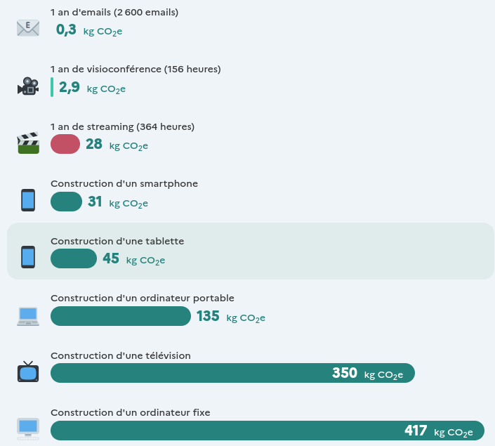
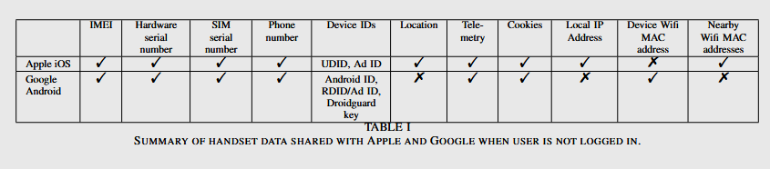

## 📰 L'impact : **Qu'est-ce qui consomme** ?
Quelques Ordres de Grandeur :
  - **L'impact principal du numérique réside dans la production des terminaux** (ordinateur, portable, mais aussi routeur et datacenter). *Source : [https://impactco2.fr](https://impactco2.fr)*
   
 *Sur le diagramme ci-dessus le streaming correspond à de la haute définition sur un grand écran en utilisant des données mobiles (4G par ex) soit le pire scénario en termes d'impact environnemental.*
  - **L'impact des Données Mobiles est (selon l'étude de 2017 de l'ARCEP) plus élevé que celui de l'internet domestique (via la fibre) d'un facteur 10** et d'un facteur 2 par rapport à du wifi (cf. impactco2.fr). 

## 🏡 Les **Petits Gestes du Quotidien**
### 🔌 Mes **Objets Numériques** 
  - **Débrancher le routeur/borne wifi** quand il n'est pas utilisé (nuit, départ) *(selon l'ademe c'est 17 € d'électricité économisés par ans soit l'équivalent de 200 tournées de 7kg de linge)*
  - **Ne pas charger les appareils** (téléphone, PC, earbuds, ...) **au-delà de 80%** pour ne pas consommer inutilement d'énergie (et ne pas abîmer les batteries). Par exemple, ne pas charger son téléphone pendant la nuit, mais ponctuellement le jour.
  - **Éteindre un appareil** (téléphone, ordinateur, écran) **quand il n'est pas utilisé**
  - **mettre en mode avion un appareil ne nécessitant pas internet** (s'il sert de réveil par exemple).

### 🌐 Mon **Utilisation d'Internet**
  - **Réduire la taille des fichiers** envoyés en pièce jointe (en utilisant [handbrake](https://handbrake.fr/downloads.php) par exemple) ou sur les réseaux sociaux.
  - Se **désabonner des newsletters** n'intéressant pas
  - **Supprimer les mails** (⚠️ S'assurer de les supprimer sur le serveur et pas uniquement en local)
  - Utiliser les **[raccourcis navigateurs](https://support.mozilla.org/fr/kb/marque-pages-firefox)** ou **taper l'URL d'un site quand on le connaît** (ou qu'on est déjà allé sur le site et que Firefox l'a enregistré) car une recherche sur un moteur de recherche est très énergivore. (**2 recherches ≈ faire bouillir une casserole d'eau**)
  - Quand je veux écouter de la musique sur YouTube, **utiliser une extension de navigateur qui coupe la vidéo** (exemple : [youtube audio](https://addons.mozilla.org/en-US/firefox/addon/youtube-audio/?utm_source=addons.mozilla.org&utm_medium=referral&utm_content=search)) ou une **application permettant de ne récupérer que l'audio** sur téléphone (exemple : [newpipe](https://f-droid.org/en/packages/org.schabi.newpipe/))

## 📲 L'**Utilisation d'Outils**

### 🔐 Des **Applications** qui n'**Écoutent pas**
- **[Tracker Control](https://f-droid.org/en/packages/net.kollnig.missioncontrol.fdroid/)** permet de **couper les trackers**, soit de ne laisser aux applications que les accès internet dont elles ont besoin, ce qui en **réduit drastiquement la consommation**. Certaines applications (une calculatrice par exemple) n'ont pas besoin d'internet, mais collectent des données pour pouvoir les vendre. *(Et par ailleurs, ça bloque les pubs dans les applis)*
- utiliser **[Signal](https://www.signal.org/) pour communiquer plutôt que WhatsApp ou Messenger** (pas de collecte de données, notamment sur des données mobiles qui sont très impactantes)

*Liste des données collectées par les applications de messagerie*
- Utiliser **[DuckduckGo](https://www.duckduckgo.com/)** ou **[Qwant](https://www.qwant.com/) pour faire ses recherches** plutôt que Google (pas de données collectées et moins de tracking sur les sites parcourus)
- Utiliser **[Firefox](https://www.mozilla.org/fr/firefox/new/) comme navigateur internet** plutôt que Chrome ou Safari pour ne pas transmettre toutes les données de navigation (et pour safari le temps passé sur chaque page et les swipes que vous faites)
- Utiliser **[F-Droid](https://f-droid.org/en/)** et **[Aurora Store](https://f-droid.org/en/packages/com.aurora.store/)** pour installer vos applications plutôt que le Play Store
- Utiliser **[Newpipe](https://f-droid.org/en/packages/org.schabi.newpipe/)** pour regarder des vidéos sur YouTube en **coupant la télémétrie**.

### 🌿 Des **Outils Utilitaires** qui s'**investissent dans la Réduction de leur Impact**
- Utiliser **[Organic Maps](https://f-droid.org/en/packages/app.organicmaps/)** plutôt que Google Maps pour avoir la **carte en local et ne pas consommer de données mobiles**. En plus cette application (contrairement à Google Maps) n'envoie pas en continu votre localisation GPS ce qui fait correspond à beaucoup de données tous les jours mis bout à bout.
- Utiliser **[Magic Earth](https://www.magicearth.com/)** plutôt que Waze qui permet en **téléchargeant en avance la carte de ne télécharger que les informations de trafic et les signalisations (d'accidents par exemple)**. Dans nos tests, cette application **utilise moins d'un vingtième des données utilisées par Waze**.

### 🔓️ Des Systèmes **Transparents** permettant de **Moins Consommer**

#### 💻️ Sur ordinateur
Si vous utilisez **Windows**, vous envoyez continuellement des **informations personnelles utilisées à des fins de marketing**. Toutefois, en configurant bien votre ordinateur, vous pouvez en envoyer une faible quantité. C'est encore pire sur Mac où les données collectées ne sont pas annoncées par la marque qui a dernièrement été attrapée [en train de **scanner continuellement toutes vos photos**](https://www.youtube.com/watch?v=6LfCJGSUcfk) **même si vous décochez les options "envoi de données"**. Deux solutions s'offrent :
  - 🥈 Utiliser une **machine sous Windows** avec des paramètres et applications tierces permettant le **blocage de la télémétrie** est envisageable
  - 🥇 Une meilleure solution serait d'utiliser une **machine sous Linux** (ce qui est le cas des machines de TP de l'INSA par exemple) que le [Club Info](https://discord.com/invite/9G8cWyK) aide à installer durant ses permanences pour ceux qui veulent de l'aide.

#### 📱 Sur téléphone

*une représentation des données collectées par Apple et Google, selon les recherches de Douglas Leith*

La **quantité de données collectées** est **faramineuse** (dans les **40 MO par mois**), vous pouvez sur Android abaisser cela en **désactivant le tracking**, en **retirant les services google** et en **désactivant les applications google**, mais sur Apple, il est impossible de changer cela. En 2022, [une étude suivie d'un procès](https://techcrunch.com/2022/11/14/apple-faces-new-lawsuit-over-its-data-collection-practices-in-first-party-apps-like-the-app-store/?guccounter=1&guce_referrer=aHR0cHM6Ly9kdWNrZHVja2dvLmNvbS8&guce_referrer_sig=AQAAALJXtVC304EmfEUlgkHR1wJGKmtzP8JWwswfvJZSzbxfI5uIZvITASi_kURd7iZGJ42xiZJFUeOY3V_iUWnahGIhBjPyFfn6UF_7IQNP_ATpSTdfZ3TEZozldhlHmUtxH26M26aWUJlu4OmyGNBZWhhZ0JJgO88fz_NGgInfxJ0I) a montré que **décocher la case "télémétrie" d'un iphone ne changeait pas la collection de données** (telles que **chaque appui sur l'écran**, **le temps passé sur les pages**, etc). Ces données envoyées en temps réel représentent un impact impossible à mesurer du fait du manque de transparence de l'entreprise. Les solutions sur téléphone seraient :
  - 🥉 utiliser un **Téléphone sous Android avec [Tracker Control](https://f-droid.org/en/packages/net.kollnig.missioncontrol.fdroid/), toutes les applications Google désactivées et remplacées par des alternatives** (ex : [Aurora Store](https://f-droid.org/en/packages/com.aurora.store/) plutôt que play store). 
  - 🥈 utiliser un **téléphone où les services google peuvent être désactivés à la volée tel que [GrapheneOS](https://grapheneos.org/)** sur les **Pixels** (pour ceux qui veulent un téléphone premium et très sécurisé). Présenté ici par [Louis Rossman](https://www.youtube.com/watch?v=yIZmUINSvQ4).
  - 🥈 utiliser un téléphone avec un **Système d'exploitation totalement coupé des GAFAMS** et un remplacement intégral des services google **comme [/e/-OS](https://murena.com/smartphones/)** sur [un grand nombre de téléphones, notamment les FairPhone](https://doc.e.foundation/devices). Présenté [ici par son créateur](https://www.youtube.com/watch?v=FwMm1phAFYE&t=34s) lors d'un événement toulousain où les membres du club étaient présents.

## 🎁 Un **Achat Respectueux**
Selon l'ADEME : ***"faire durer nos équipements numériques constitue le geste le plus efficace pour diminuer leurs impacts"***. Donc même si vous avez un Apple qui vous espionne et qui est conçu avec une obsolescence programmée, **il vaut mieux le garder jusqu'à ce qu'il ne marche plus** (d'un point de vue écologie, pas d'un point de vue sécurité ou vie privée).

*Exemple de la décomposition des impacts d'un ordinateur selon l'ADEME*

Nous présentons ci-dessous deux excellentes initiatives, mais la règle générale à retenir est d'essayer de regarder ce qui **se répare le mieux**, ce qui **est supporté par le fabricant le plus longtemps** et ce qui **n'est pas critiqué pour obsolescence programmée**.

### 📱 Fairphone : Des **Téléphones du Futur**
- Le **[Fairphone](https://www.fairphone.com/fr)** est un téléphone garanti **pour 5 ans au moins de support** (bien que dans la pratique le FairPhone 2 ait eu plus de 7 ans de mises à jour, ce qui est du jamais vu ailleurs).
- Il est **totalement modulaire** ce qui permet de le **réparer pour très peu cher en changeant juste le composant endommagé** (la batterie est morte? Il suffit d'acheter une [batterie](https://shop.fairphone.com/fr/fairphone-4-battery) de rechange pour 30€ et de la changer soi-même, pareil pour l'écran, le port USB, etc). Il est aussi possible d'acheter des pièces pour l'**améliorer** sans en acheter un nouveau (ex : une nouvelle caméra plus performante).
- Leur **[score de réparabilité](https://www.ifixit.com/News/55818/fairphone-4-teardown-if-only-apple-made-phones-like-this) sur Ifixit est de 10**, ce qui contraste avec les autres fabricants (dans les 6 pour Google, Apple ...).

*Image des composants réparables du Fairphone 3*

### 💻️ Framework : Un **Ordinateur Couteau suisse Réparable**
- Les ordinateurs [Framework](https://frame.work/fr/fr) sont des portables totalement réparables où les composants ne sont pas soudés (ce qui permet de les changer et aussi de les remplacer par des composants plus à jour sans avoir à refaire tout l'ordinateur).
- Les ports (USB, HDMI, Ethernet) peuvent être changés facilement (il suffit de les clipser et déclipser) comme montré [dans cette vidéo](https://youtu.be/lCO31iiZtHQ?t=481)

*Image des composants réparables du Framework, les ports customizables sont en bas à gauche*

## Le Discord du Club
Si tu as des questions que tu n'as pas pu poser, tu trouveras [là-bas](https://discord.com/invite/9G8cWyK) des étudiants pour y répondre !

<!-- 

  <iframe class="pb-32" style="position: absolute; top: 0; left: 0; width: 100%; height: 100%; border:0;" src="https://www.youtube.com/embed/Vpi7Ad7ReOU?start=351s&end=402" />

 -->

